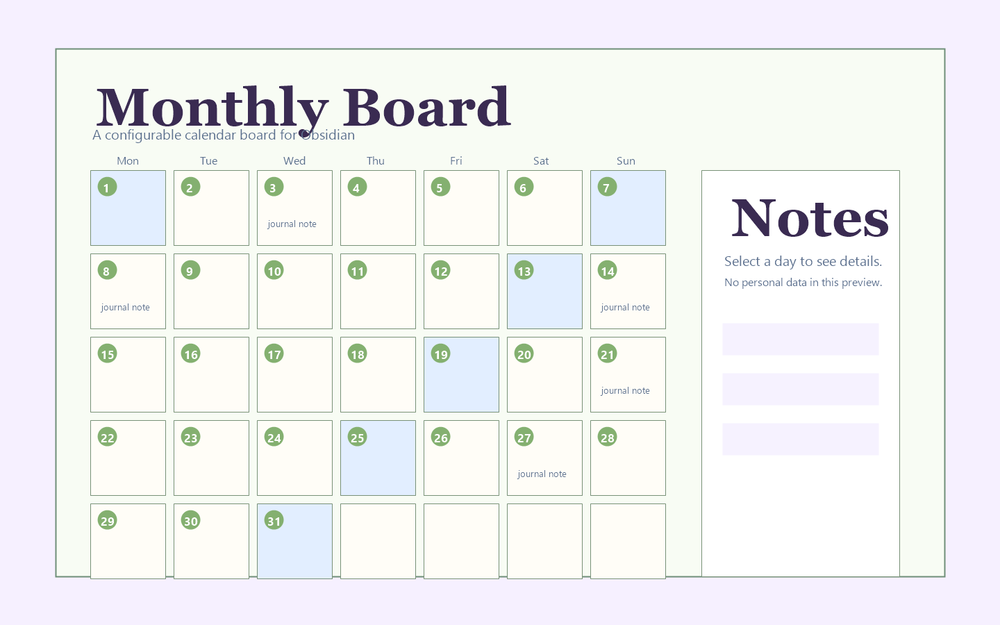

# Monthly Board



Monthly Board is a configurable Obsidian calendar board for people who want a visual monthly overview of journals, tasks, clippings, project notes, and photos.

Instead of locking you into one vault structure, Monthly Board reads a vault-relative JSON config file. You can decide which folders are scanned, which frontmatter fields count as dates, how daily/weekly/monthly notes are resolved, and whether the board should use custom fonts or background presets.

The plugin is especially useful if your vault contains date-based notes from different sources, such as daily notes, task pages, saved articles, travel notes, or imported content. It collects those dated items into a single monthly board, shows a detail panel for each day, and can display local or remote images as day covers.

## Features

- Render a `monthly-board` Markdown code block.
- Read a safe vault-relative `.json` config file.
- Collect daily notes and related pages by configurable date fields.
- Support multiple source folders through Dataview queries.
- Auto-detect Obsidian wiki images, Markdown images, and remote image URLs.
- Display a selected day detail panel with notes, links, related items, and photos.
- Double-click a day cell to open its daily note.
- Keep UI state locally, including selected month, theme, side panel width, cover choices, and custom background.
- Support custom handwriting fonts and background presets.
- Use a responsive layout that compresses the side panel on narrow panes.
- Open an external floating monthly board window from Obsidian.
- Refresh the external board manually or when the entry note/config changes.
- Persist external window size, position, compact display options, and always-on-top preference.

## Requirements

- Obsidian `1.5.0` or later.
- Dataview plugin enabled.

## Installation for testing

Copy these files into your vault:

```text
.obsidian/plugins/monthly-board/
  manifest.json
  main.js
  monthly-board.js
  styles.css
```

Then restart Obsidian and enable `Monthly Board` in Community plugins.

## BRAT testing

This repository is structured as an Obsidian plugin repository root:

```text
manifest.json
main.js
monthly-board.js
styles.css
versions.json
README.md
example-config.json
```

To test with BRAT:

1. Install and enable the BRAT plugin.
2. Choose `Add Beta plugin`.
3. Enter this repository URL.
4. Enable `Monthly Board` after BRAT installs it.

## Usage

Create a JSON config file in your vault. You can start by copying:

```text
example-config.json
```

For example, copy it to:

```text
_tools/monthly-board/monthly-board.config.json
```

Then put this code block in any note:

````markdown
```monthly-board
config: _tools/monthly-board/monthly-board.config.json
```
````

The `config` path must be a relative `.json` file inside the current vault.

## External floating monthly board

The recommended floating-window path is the built-in external window command. It does not require installing another Obsidian plugin. The window is opened by the Obsidian client, can sit outside the main Obsidian workspace, and reuses the existing `monthly-board` entry note and vault-relative JSON config.

### Preflight checks

Use the Obsidian command palette:

1. Run `Inspect monthly board entry` to verify that Monthly Board can find the note containing the `monthly-board` code block and its config path.
2. Run `Check monthly board window options` to see whether the current environment supports in-app floating, external window opening, native always-on-top, and fallback guidance.
3. Run `Validate external monthly board compatibility` to check Windows compatibility, config readability, refresh listeners, saved bounds, display options, and fallback behavior.

### Open and refresh

- Run `Open external floating monthly board` to open the external calendar window.
- Run `Refresh external floating monthly board` to reload the external window manually.
- Use the `刷新` button in the external window header for an in-window manual refresh.
- When the source entry note or JSON config is modified, deleted, or renamed, the external window attempts to refresh and shows a status message.
- Closing the external window does not close or modify the original Obsidian note.

### External window settings

Open the `Monthly Board` settings tab to adjust:

- `External window size`: initial or last saved size for the external window.
- `Prefer always on top`: tries native always-on-top first. If unavailable on Windows, use PowerToys Always on Top with `Win+Ctrl+T`.
- `Compact external window`: hides non-essential Monthly Board chrome where possible.
- `Minimal external header`: shrinks the external header so the calendar has more room.
- `Light borderless external style`: reduces visual frame and background chrome. This is a visual style, not a native OS frameless window.
- `External window opacity`: visual background opacity from `55` to `100`.

### Known limitations

- The external window is still created by Obsidian/Electron; it is not a separate native desktop app.
- Native always-on-top support depends on whether the current Obsidian/Electron runtime exposes the required API. If not, use an OS-level window pinning tool.
- The plugin only reads vault-relative `.json` config files and does not execute config code.
- If the source note or config becomes unavailable, the external window shows an error/status message instead of modifying notes.

## Minimal config example

```json
{
  "journal": {
    "query": "\"Journal\"",
    "dailyFilePattern": "^\\d{4}-\\d{2}-\\d{2}$"
  },
  "dateFields": ["date", "created_at", "modified_at", "due"],
  "sources": [
    { "query": "\"Journal\"", "label": "Journal" },
    { "query": "\"Projects\"", "label": "Projects" }
  ]
}
```

## Configuration overview

### `journal`

Controls where daily notes are found.

```json
{
  "journal": {
    "query": "\"Journal\"",
    "dailyFilePattern": "^\\d{4}-\\d{2}-\\d{2}$"
  }
}
```

### `dateFields`

Fields that Monthly Board checks when assigning a page to a calendar day.

```json
"dateFields": ["date", "created_at", "modified_at", "due"]
```

### `sources`

Additional Dataview sources to scan for dated pages.

```json
"sources": [
  { "query": "\"Projects\"", "label": "Projects" },
  { "query": "\"Clippings\"", "label": "Clippings" }
]
```

### `periodicNotes`

Optional templates for resolving year, month, and week notes.

```json
"periodicNotes": {
  "year": ["Journal/{year}/{year}.md"],
  "month": ["Journal/{year}/{monthNameEn}, {year}.md"],
  "week": ["Journal/{isoYear}-W{week2}.md"]
}
```

### `theme`

Optional visual configuration.

```json
"theme": {
  "handwritingFont": "Attachments/fonts/my-font.ttf",
  "backgroundPresets": [
    { "name": "winter", "label": "Winter", "image": "![[winter-background.png]]" }
  ]
}
```

## Image detection

Monthly Board can detect:

- Obsidian wiki images: `![[image.jpg]]`
- Markdown images: ``
- Remote images: `https://example.com/image.jpg`
- Frontmatter fields commonly named `image`, `cover`, `banner`, or `images`

The preview image in this README is an anonymized mock screenshot. It does not contain personal notes, vault names, private file paths, or real user data.

## Security notes

- The plugin only reads a relative `.json` config file inside the current vault.
- It does not execute JavaScript config files.
- It does not read absolute paths or files outside the vault.
- It does not access tokens or external service credentials.
- It does not write to Notion or any remote service.
- It uses Dataview only to read pages from the current vault.
- External floating windows are opened locally by the Obsidian client; no remote service is contacted for this feature.

## License

MIT License. See [LICENSE](LICENSE).

## Current status

This is an MVP release suitable for local testing or BRAT testing. Before submitting to the official Obsidian community plugin directory, the settings UI and documentation should be expanded further.
